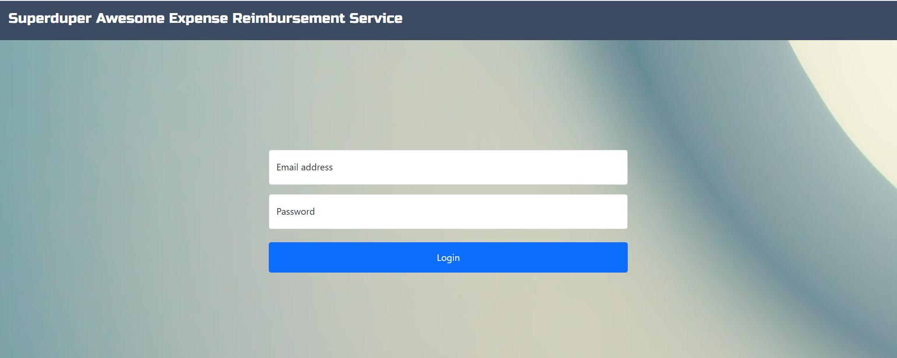
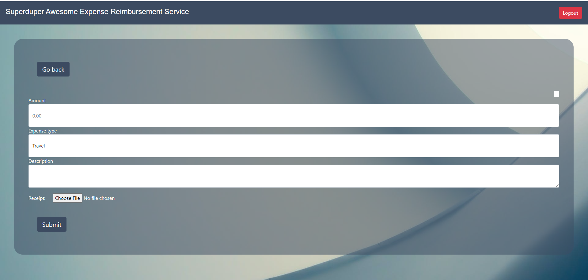
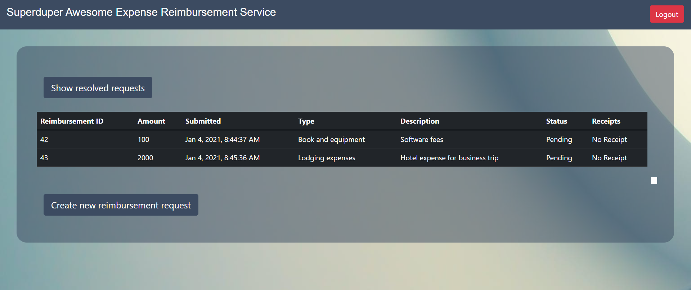
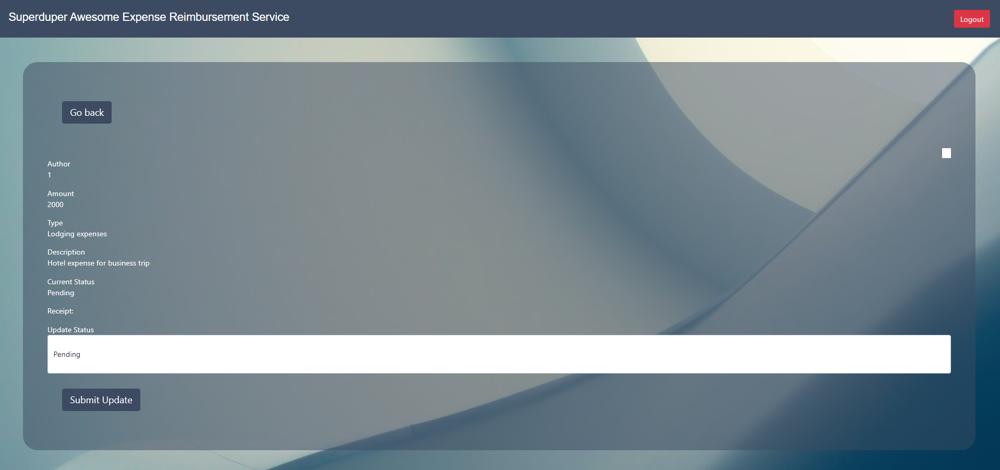
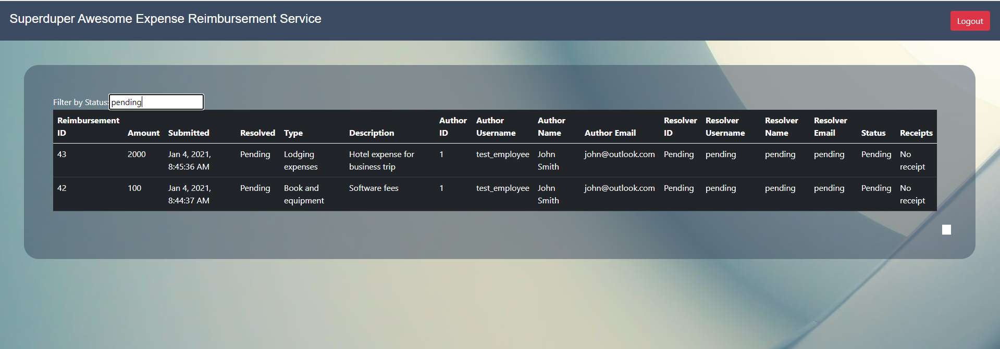

# Superduper Awesome Reimbursement Service

## Project Description

The Superduper Awesome Reimbursement Service provides employees with a seamless and intuitive 
way to make reimbursement requests to their employer. The employees are able to make requests of
different varieties for medical, travel, and equipment expenses and upload receipts in a PDF or image format.
Employees are then able to check the status of the requests they've made. Meanwhile, financial managers are able to
also seamlessly look for pending requests to handle and either accept, reject, or put them on hold. Financial managers
could also download the receipts uploaded by the employees. 

## Technologies Used

### BackEnd

* Java
* Tomcat Server
* Maven
* PostgreSQL

### FrontEnd

* HTML
* JavaScript
* CSS

### Development Tools

* Visual Studio
* Spring Tools Suite
* DBeaver

## Features

* The user is able to sign in as either an employee or financial manager
* Employees are able to create requests and upload receipts
* Employees can check past requests they've made and their statuses
* Financial managers can view all requests 
* Financial managers can filter requests based on status
* Financial managers could change the status of a request that hasn't been resolved 
* Both employees and financial managers are able to logout

## To-do list:

* Storing passwords in the database as salted hashes
* Verifying file types of uploaded receipts from the backend to ensure they are of a valid type
* Creating an error page for when the user enters in an invalid or unauthorized request to the system 

## Getting Started

### Clone command:
```
git clone https://github.com/2011Canada/project-1-Stephen491.git
```

### Requirements

* Java Version 8

[<https://www.oracle.com/ca-en/java/technologies/javase-downloads.html>](https://www.oracle.com/ca-en/java/technologies/javase-downloads.html)

* DBeaver

[<https://dbeaver.io/download/>](https://dbeaver.io/download/)

* RDS on Amazon AWS 

[<https://aws.amazon.com/>](https://aws.amazon.com/)

#### Step 1
* Open Dbeaver and connect to the PostgreSQL database on RDS 

#### Step 2
* Run the the ERS_script.sql file in Dbeaver

#### Step 3
* Start the backend of the application on a Tomcat server 

#### Step 4
* Visit http://localhost:8080/project-1-Stephen491/login.html

#### Step 5
* Login using the credentials of one of the users inserted into the database from ERS_script.sql

## Usage 

* Users can login as either an Employee or as a Manager




* Employees can apply for reimbursement



* Employees can view all personal current and past tickets



* Employees can logout by clicking the logout button at the top right corner

* Financial managers can view all tickets(both current and past) and handle them by clicking on them in the table


* Financial managers can change the status of a request



* Financial managers can filter by ticket status (pending, on hold, approved, rejected)



* Financial managers can logout by clicking the logout button at the top right corner

## License

This project uses the following license: [GNU GENERAL PUBLIC LICENSE](<https://www.gnu.org/licenses/gpl-3.0.en.html>).
